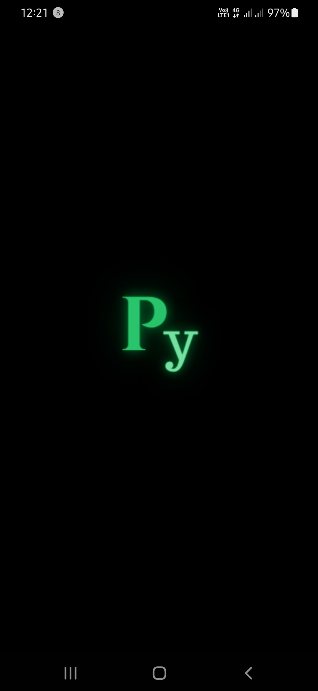
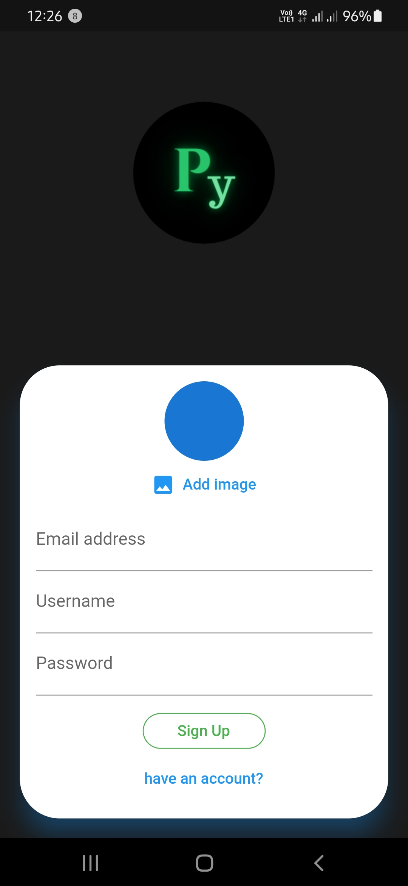

# PyChat
Chat Application made in Flutter using Firebase. Also added animated splash screen with Pychat logo.

## Languages and Tools Used:
<code> Flutter</code>
<br>
<code> Dart</code>
<br><code> Firebase</code>

## Description

- Place your ```google-services.json``` file into your app's ```/android/app``` folder.

## Authentication used in this App

- Email, Password and Image upload.


## Screenshots
<p float="left">
    
    
    
## Note
This project is still under development.

## Created & Maintained by 
[Vaibhav](https://iamvaibhav.netlify.app/)
